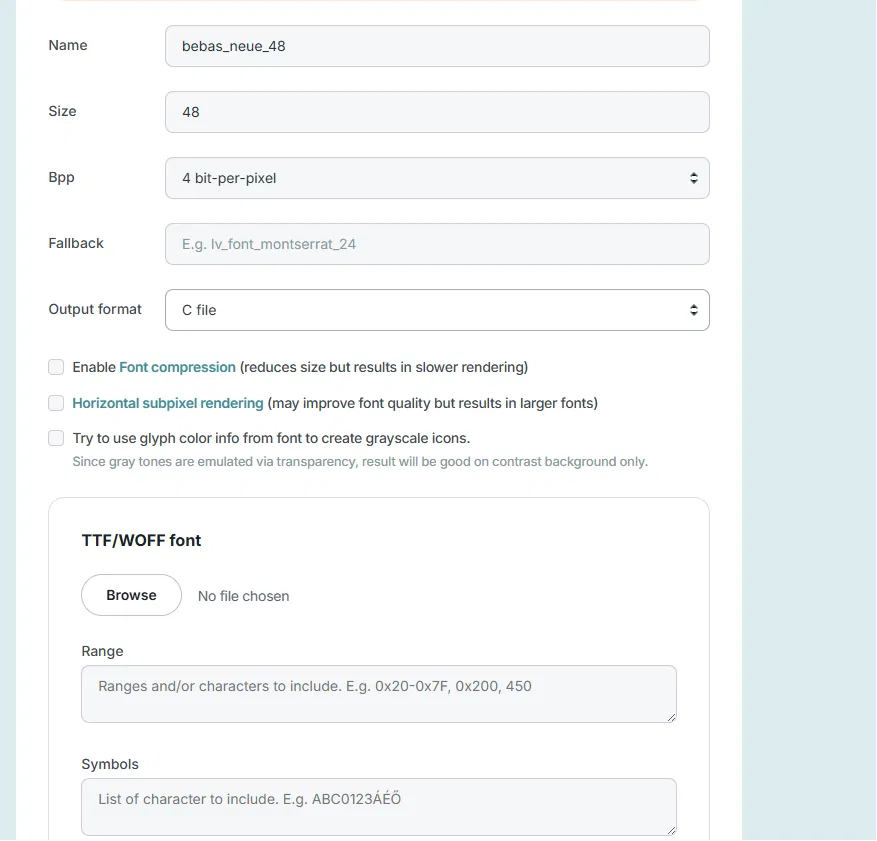
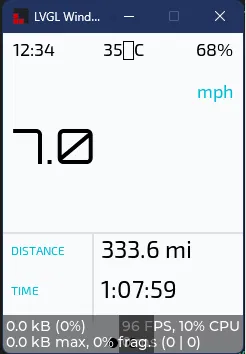
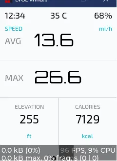
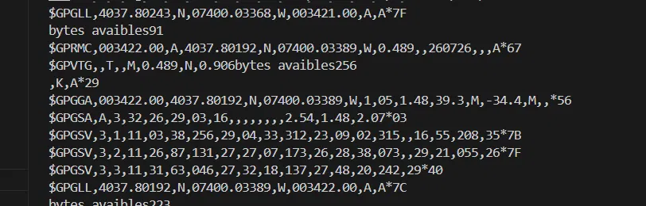

# July 1: Brainstormed UI layout 
I Sketched out initial concepts for the bike computer interface and what data to display and how to split it across screens.

Photos:

**Total time spent: 1h**

# July 5: Figured out how to get LVGL components on the LVGL simulator
Got the LVGL simulator running on desktop so I can prototype UI components without having to flash the ESP32 every time I change something. This is going to save a lot of iteration time later on.

Photos:

**Total time spent: 1h**

# July 10: Made a lot of different components & objects, made the simulator adaptable by flickering through screens and increasing values
Made a variety of components and objects for the interface. To make the simulator more useful for testing, I set it up to cycle through screens automatically and animate values so I can see how the UI behaves with changing data rather than static placeholders. It was offcenter so I will fix that later. Overall the UI is working as intended.

Photos:

**Total time spent: 2h**

# July 15: Wired Screen up to ESP32, got the UI flashing, Added platformio
Going into this project, I had quite a bit of Arduino experience. But I wondered, is it possible to start microcontroller projects without using the Arduino IDE? After doing some research, I figured out that you could use the platformio extension to run microcontrollers directly on VSCode. It was quite a difficult process to get platformio working however, as you had to define a lot of things that the Arduino IDE would otherwise do for you immediately. It look a lot of tinkering to get the code to work out the way it did, and to finally display on the screen. Before I figured it out it was flashing the same error code and trying to reset itself multiple times because it couldn't find the right upload connection. But after specifying the connection I wanted it to use in the platformio.ini file it finally displayed. This was the longest part of setting it up, the wiring was relatively easy. 

Photos:

**Total time spent: 2h**

# July 17: Changed some fonts up to make the UI look more appealing

Now that I got the UI to work on the screen, I decided to experiment with some fonts and colors to make the UI look less monotone. I decided to go with a futuristic kind of font that is still legible. Because I am using LVGL to display information on the LCD I have to convert the new fonts to a way LVGL can read. This was a rather tricky process because I have to individually download every font size and font and convert it to LVGL. There were also a lot of errors while using this new font, because I had to declare it in the ui.h folder as a c file, but vscode was reading it as a c++ file. Had to search up the problem and then fix it. Additionally, with my simulator, it was having all kind of errors because VS Studio couldnt access the stuff i was storing in the ui.h folder so I had to completely reinvent how I used the simulator. Instead of making static pointers that are only available in the ui.cpp folder i removed it and then extern it in the ui.h folder so it was universal and all folders could access it. This also made it easier to use the LVGL simulator because I didn't have to copy paste the code every time I changed it to the LVGL cpp file, I could just change the functions themsleves and have the simulator still work. 

Photos:

**Total time spent: 2h**

# July 23: Made the UI prettier

I thought the UI was pretty basic and there wasn't that much going on, it was just numbers. I decided to rewrite the UI to make it look cleaner and look like a actual bike computer UI. It looks pretty cool and slick now. Additionally I made the header section independent of each screen by putting it on the base screen, so now its not affected by the other screens PLUS i dont need to add a additional pointer to the header objects everytime i make a new screen. Also I realized that the font folder didn't include symbols like degrees and im too lazy to add a new one to include the degree symbol so I just removed it. Maybe in the future ill put it back.

Photos:

**Total time spent: 2h**

# July 25: Started testing and making the gps screen

I started with wiring up the gps module up to the rest of the components. I ran into some issues as the gps was not locking on to any sattlelites so i thought that i mightve been a wiring issue so i used a led to test my setup and it was correct. otherwise, I troubleshooted by making sure the platformio was locking onto the esp32 correctly off rip. The wiring wasn't the issue, I just had to wait for the gps a little. Took a decent while of troubleshooting by testing if my gps module was actually sending data to my esp32, where i used a byte test. It was, so I decided to wait and eventually it connected to my location. Will start testing irl next.

Photos:

**Total time spent: 2h**

# August 6: Started making the CAD enclosure/brainstorming
Began making the housing for all my parts. I was thinking that the gps module should be flush with the lcd screen, not under it, so it can have the most connection to the sky as I already was having problems with gps connectivity in this project before. 

**Total time spent: 1.5h**

# August 7: Made a few design aspect decisions 

Sd card mechanisms, sliding shield to protect it when not in use, easy access and storage. I was planning to add a small 2mm thickness shield that you can slide into the top of the case so whenever you arent using the bike computer it will be protected from the environment. I was thinking about some sort of a SD card slot mechanism to lock the slider in place, but I realized that if I made the clearance decently tight the friction will solve that issue for me regardless.

**Total time spent: 0.5h**

# August 10: Troubleshooted UI not updating & Serial Monitor issues

While I was working on the GPS and actually getting the gps to update the UI, I realized that there was a huge problem with the UI: It wasn't updating or anything, but the general UI still flashed. I added a screensaver to test if it was actually stuck or nothing was just updating. The former was true, and when the screensaver was supposed to circle around, it was just stuck. I realized that although the UI was rendering it probably stopped updating after like 2 frames. So I had to do a series of troubleshooting, where I tested the UI in various ways, and realized that the tick counter was the thing I had to initialize because in my platformio.ini I chose to ignore it. After I fixed that I also had to fix the serial monitor because all of my Serial.println was not rendering in the serial monitor. I realized this was because in my build flags I had directories to dfferent ports, and the serial monitor couldn't receive the information because of that. After I deleted those two directories the serial monitor was finally able to work reliably. 

**Total time spent: 1.5h**

# August 12: Improved CAD
Refined the CAD. added a enclosement for the gps module at the top. added fillets and chamfers to the screw holes and the outside. added a cross and removed filament where the gps sits to make it receive signal better. I printed it out as a first prototype, and the clearances were pretty successful. The only issue is that the supports where the shield is supposed to be came out weird so I will have to address that in the future as I am reiterating. 

**Total time spent: 1.5h**

# August 14: Quick bug updates and intentional code data stops
While testing the gps UI, I realized that I couldn't rely on my GPS the same way I could rely on a apple gps. Because apple gps systems are more advanced, they are able to display your location with minimal inaccuracies. My gps module was pretty accurate, but the only issue as that those small inaccuracies could build up and result in a inaccurate result. For example, I noticed that when there was a gust of wind, the gps would start producing results that were completly abnormal. Although I knew that the wind gusts wouldnt be a problem after the module was inside my enclosement, probably beacuse the gps was moving as it wasn't on a flat surface, I realized that this could be a significant issue if not fixed as both the distance and speed were changing. If the module added unnessecary distance while moving it could skew the final results of the full ride. I fixed that by adding code that treated values lower than a amuont I set it to be essentially nonexistent so those values wouldn't add up or show on the lcd. Additionally I wondered if the polling rate of the gps could be increased to give more accurate readings, and it did so I implemented that code. Then as I was testing my gps I realized that the gps kept showing F, and I wondered if that meant that something wasn't rendering. A quick google search let me to consider that platformio didn't create one of the build flags again so I searched up the solution to that and fixed the bug. 

**Total time spent: 1h**

# August 20: Added buttons to my project for switching screens back and forth
Added buttons to the project, wired them up, and coded them. I had to add a extra function because the current switch screen function only had one purpose to keep swiping to the next and there was no back feature. Works great. 

**Total time spent: 0.5h**

# August 21: started wiring up the other stats: max speed and avg speed 

**Total time spent: 2h**